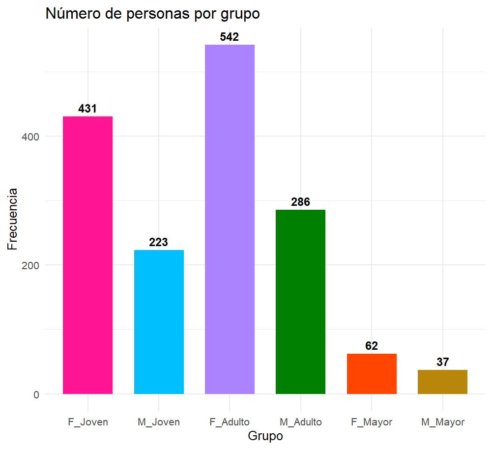
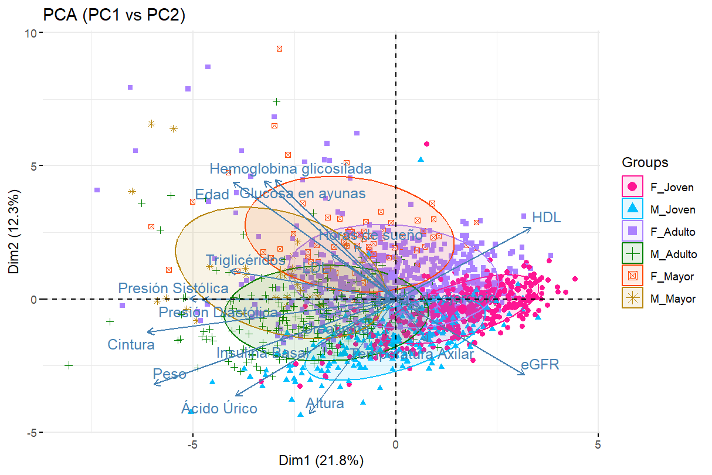
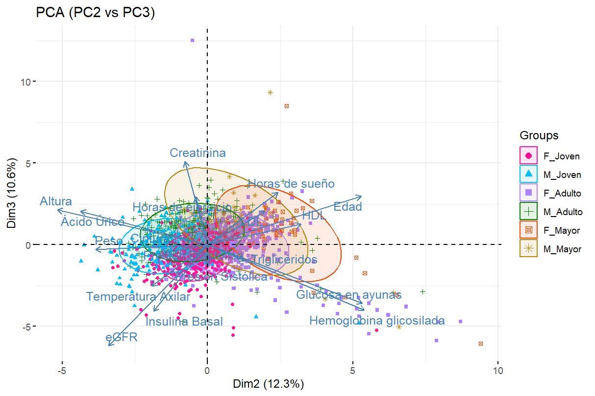
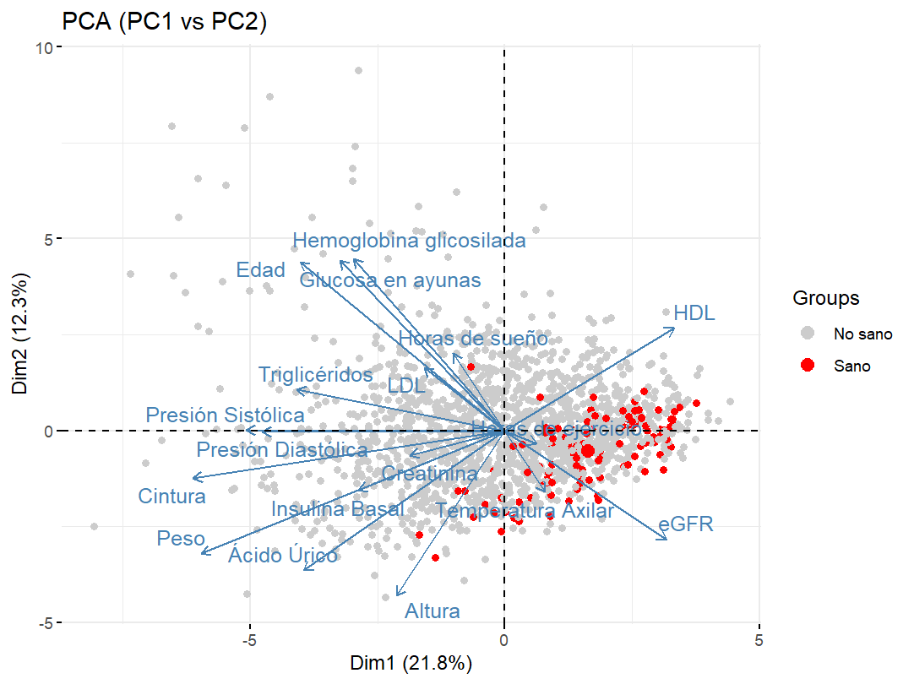
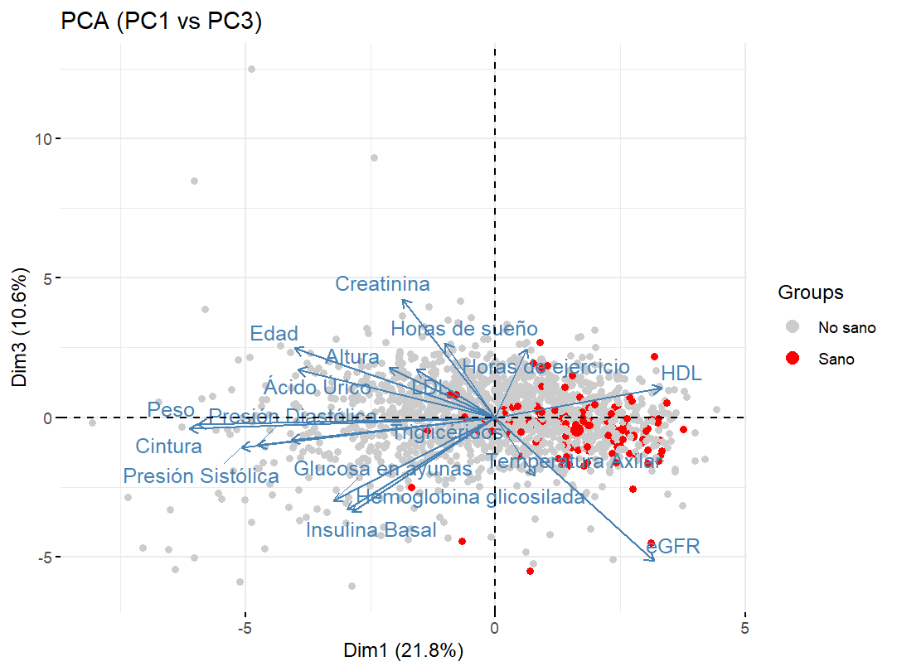
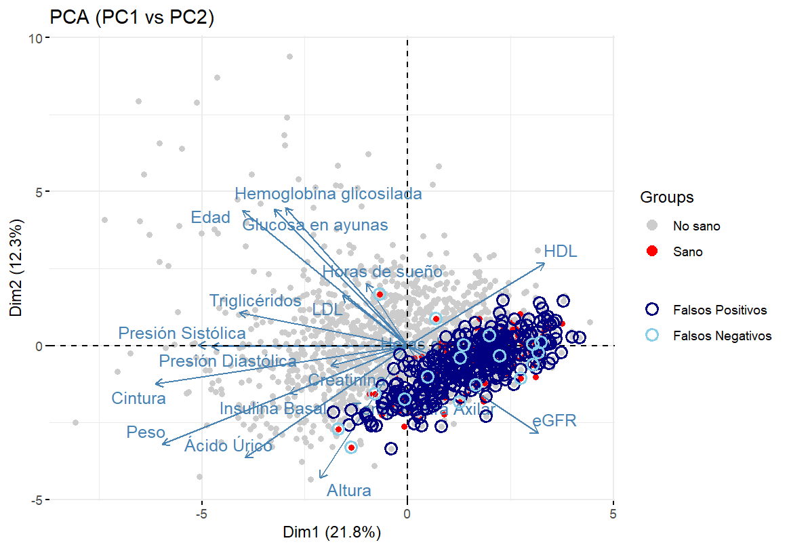

# Tesina de Especialidad en Estadística Aplicada (IIMAS - UNAM)

## 📘 Descripción
Proyecto desarrollado en RStudio como parte de Tesina de la Especialidad en Estadística Aplicada.  
El objetivo del análisis fue evaluar la capacidad predictiva de distintos métodos multivariados para distinguir entre individuos clasificados como *sanos* y *no sanos*, con base en variables fisiológicas, antropométricas y de estilo de vida.

> ⚠️ La base de datos utilizada no es pública, por lo que solo se incluyen resultados y visualizaciones derivadas del análisis.

---

## Métodos aplicados
- Análisis descriptivo por grupo de edad y sexo  
- Análisis de Componentes Principales (PCA)  
- Análisis Discriminante Cuadrático (QDA)  
- Análisis Logístico con aplicación de Curvas ROC y métricas de clasificación

---

## Lenguaje y entorno
- **R 4.4.1**
- **RStudio 2025.05.0 Build 496**
- Principales librerías: `tidyverse`, `ggplot2`, `factoextra`, `MASS`, `pROC`, `broom`

---

## 📊 Visualizaciones principales

### Gráficos descriptivos
Grupos de estudio por edad y sexo

  

Individuos sanos y no sanos.

  

---

### Análisis de Componentes Principales (PCA)
Grupos de estudio por edad y sexo

  
  
  
 

 Individuos sanos y no sanos.

  
  
  

---

### QDA
- Evaluación de la capacidad predictiva con QDA e Identificación de falsos positivos y falsos negativos  

  
  
  
 

 
---
 
### Logístico con Curva ROC y puntos óptimos mediante diferentes índices.

  
 

---

## 🎓 Créditos
**Autora:** Luz Santana  
**Fecha:** Octubre 2025  
📧 **Contacto:** luzsantanajaimes7@gmail.com  
🔗 [LinkedIn](https://www.linkedin.com/in/luz-mar%C3%ADa-concepci%C3%B3n-santana-jaimes-29576a209/)  

